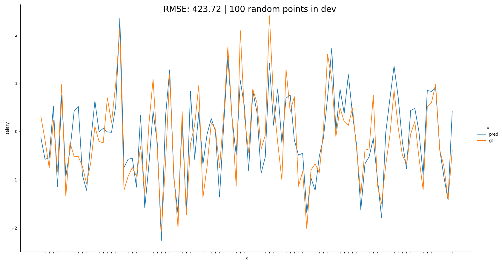

<h1 align="center">
  <br>
  <a href="https://drive.google.com/uc?id=1G7-wQtubqNCrpKrLkQrs4NSSxqmb13U2"></a>
  <br>
  INDEED
  <br>
</h1>

<p align="center">
  <a href="#code-structure">Code</a> •
  <a href="#how-to-use">How To Use</a> •
  <a href="#docker">Docker</a> •

[comment]: <> (  <a href="#notebook">Notebook </a> •)
</p>


### Code structure
```python
from setuptools import setup
from indeed import __version__

setup(
    name="indeed",
    version=__version__,
    short_description="indeed",
    long_description="indeed",
    packages=[
        "indeed",
        "indeed.core",
        "indeed.tests",
        "indeed.models",
    ],
    include_package_data=True,
    package_data={'': ['*.yml']},
    url='https://cadic.jp',
    license='MIT',
    author='CADIC Jean-Maximilien',
    python_requires='>=3.8',
    install_requires=[r.rsplit()[0] for r in open("requirements.txt")],
    author_email='me@cadic.jp',
    description='indeed',
    platforms="linux_debian_10_x86_64",
    classifiers=[
        "Programming Language :: Python :: 3",
        "License :: OSI Approved :: CMJ License",
    ]
)

```
### Configuration file
```yaml
model_path: "/FileStore/indeed/indeed.pkl"
output_csv: "/FileStore/indeed/test_salaries.csv"

features:
  cat   : ["companyId", "jobType", "degree", "major", "industry"]
  num   : ["yearsExperience", "milesFromMetropolis"]
  y     : ["salary"]
  best  : ['companyId', 'degree', 'industry', 'jobType', 'major', 'milesFromMetropolis', 'yearsExperience']

etl:
  xtrain_csv  : "/FileStore/indeed/landing/train/train_features.csv"
  ytrain_csv  : "/FileStore/indeed/landing/train/train_salaries.csv"
  xtest_csv   : "/FileStore/indeed/landing/test/test_features.csv"
  bronze_csv  : "/FileStore/indeed/bronze/indeed_data.csv"
  gold_csv    : "/FileStore/indeed/gold/indeed_data.csv"
  x:
    mu:
      companyId           : 31.01350
      jobType             : 3.50253
      degree              : 2.06087
      major               : 2.57819
      industry            : 2.99925
      yearsExperience     : 11.99724
      milesFromMetropolis : 49.52784
    std:
      companyId           : 18.19029
      jobType             : 2.29183
      degree              : 1.43470
      major               : 2.39732
      industry            : 2.00011
      yearsExperience     : 7.21278
      milesFromMetropolis : 28.88372
  y:
    mu  : 116.06182
    std : 38.71794


models:
  regression_tree :
    max_depth: 13
```

### How to use
To clone and run this application, you'll need [Git](https://git-scm.com) and [ https://docs.docker.com/docker-for-mac/install/]( https://docs.docker.com/docker-for-mac/install/) and Python installed on your computer. 
From your command line:

Install the package:
```bash
# Unzip the zip file
unzip indeed.zip

# Go into the repository
cd indeed
```

1. Run the etl jobs:
```shell
python -m indeed.etl
```


2. Run the exploration:
```shell
python -m indeed.core
```

You should be able to get some similar output
```shell
Grid processing: 100%|███████████████████████████████████████████████████████████████████████████████████████████████████████████████████| 1000/1000 [04:57<00:00,  3.36it/s]
+-----+-------------+---------------------------------------------------------------------------------------------------+----------+
|     |   max_depth | features                                                                                          |    score |
+=====+=============+===================================================================================================+==========+
| 834 |          13 | ['companyId', 'degree', 'industry', 'jobType', 'major', 'milesFromMetropolis', 'yearsExperience'] | 0.723503 |
+-----+-------------+---------------------------------------------------------------------------------------------------+----------+
| 838 |          13 | ['companyId', 'degree', 'industry', 'jobType', 'major', 'milesFromMetropolis', 'yearsExperience'] | 0.723488 |
+-----+-------------+---------------------------------------------------------------------------------------------------+----------+
| 614 |          14 | ['companyId', 'degree', 'industry', 'jobType', 'major', 'milesFromMetropolis', 'yearsExperience'] | 0.723127 |
+-----+-------------+---------------------------------------------------------------------------------------------------+----------+
| 618 |          14 | ['companyId', 'degree', 'industry', 'jobType', 'major', 'milesFromMetropolis', 'yearsExperience'] | 0.723108 |
+-----+-------------+---------------------------------------------------------------------------------------------------+----------+
| 836 |          13 | ['companyId', 'industry', 'jobType', 'major', 'milesFromMetropolis', 'yearsExperience']           | 0.722435 |
+-----+-------------+---------------------------------------------------------------------------------------------------+----------+

```

3. Plot the results with the best hyperparameters on 100 random points:
```shell
python -m indeed.models
```


3. Inference on the test set:
```shell
python -m indeed
```

### Docker
```shell
cd scripts && ./build && ./docker
```
